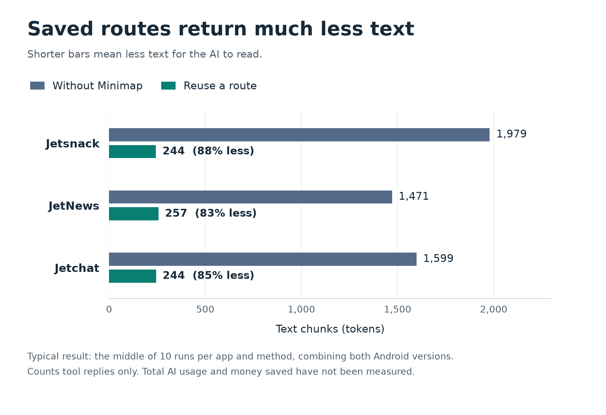
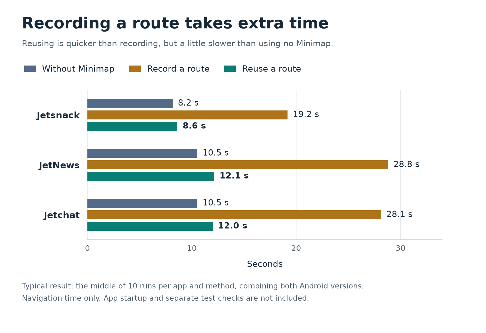

# Minimap

Android navigation memory for AI agents.

Minimap helps an AI remember how to get around an Android app. Teach it a route
once, such as Home → Settings, then ask it to follow that route and check the
screen it reaches. Following a saved route does not need a new AI decision for
every tap.

The routes live in your project's `.minimap/` folder. Commit them to Git so your
teammates and their AI agents can use what has already been learned.

## Results

**Saved routes returned about 83–88% less text for the AI to read.** Navigation
was a little slower than the script without Minimap; we have not measured a
saving on an AI bill.

We tested three Android sample apps on two emulators running different Android
versions (APIs 36 and 37). Each trip took one or two taps, and every test script
already knew the route. We compared three ways to make the same trip:

| Method | What it does |
| --- | --- |
| Without Minimap | Uses regular Android tools to follow the route and check the screen. |
| Record a route | Sets up Minimap and saves the steps for the first time. |
| Reuse a route | Follows a fresh copy of the saved route, like a teammate using it. |

**All 90 navigation tests reached the right destination:** 30 tests per method,
with five repeats for each app on each Android version.

### Less text for the AI to read

A *token* is a small chunk of text an AI reads. We counted the text returned by
the navigation tools. For roughly every 100 tokens returned without Minimap,
reusing a saved route returned just **12–17**.



### Recording takes time; reusing is quicker

Recording a route took about **19–29 seconds**. Reusing one took about
**9–12 seconds**, compared with **8–11 seconds** without Minimap.
The benefit shown here is less text for the AI to read; these scripts did not
finish faster with Minimap.



Each bar shows the **middle result (median)** from 10 runs per app and method,
combining both Android versions. Times cover navigation, including recording
when needed; they leave out app startup and the separate test checker.

### What still needs testing?

- **The full AI cost:** these counts leave out instructions, the AI's thinking, and other conversation text, so fewer tool tokens do not yet prove a lower bill.
- **The cost of repeated instructions:** our estimates show that loading Minimap's full instructions for every task can erase the text savings in JetNews and Jetchat.
- **An AI handling surprises on its own:** all 16 scripted change and error checks passed, including moved buttons and wrong profiles, but independent AI discovery and repair have not been tested.
- **More kinds of trips:** these were short routes in three sample apps on one computer, so we still need longer routes and more devices and app states.

An earlier run had app-startup failures. The 90/90 result above is from a
separate run that waited for the app to be ready; the earlier failures remain
in the report.

See the [full results and every test](evals/results/2026-09-17-benchmarks/README.md)
for the detailed graphs, data, and cost estimates.

<details>
<summary>How these graphs were made</summary>

These graphs summarize the September 16–17, 2026 experiment using its
[saved measurements](evals/results/2026-09-17-benchmarks/benchmark.json).
They do not represent a new test run. Each bar combines five runs on API 36
and five on API 37; token labels are rounded to whole tokens and times to a
tenth of a second. Percentage labels compare the unrounded token medians.
Tokens use the `o200k_base` counting method; they are not measured model usage.

To rebuild the README images from the repository root:

```bash
python3 -m venv /tmp/minimap-chart-env
/tmp/minimap-chart-env/bin/pip install -r evals/requirements-benchmarks.txt
/tmp/minimap-chart-env/bin/python evals/readme_charts.py
```

The [chart script](evals/readme_charts.py) reads the existing measurements and
updates only the two README images. The detailed report keeps the results for
each Android version separate and shows every run.

</details>

## Install

From a checkout:

```bash
cargo build -p minimap-cli --bin minimap
```

Building requires Rust 1.89 or newer.

From source after publication:

```bash
cargo install --git https://github.com/mttmcknn/minimap minimap-cli
```

## Basic Workflow

Initialize the repo and install agent skills:

```bash
minimap init --agents all --package com.example.myapp
minimap doctor
```

Label the current place:

```bash
minimap whereami --label home
```

Navigate and learn a verified transition:

```bash
minimap tap --selector "text=SEARCH" --label search --reason "open search"
```

Reuse the graph:

```bash
minimap go search --expect "text=Categories"
```

Use raw layout only when the agent needs details Minimap does not model:

```bash
minimap layout
```

`layout` returns redacted Android layout plus Minimap orientation metadata.
Unlabeled `whereami` returns compact orientation. If either immediately follows a
fresh verified observation, Minimap can serve the cached session state instead
of paying for another Android layout capture.
Use `layout --fresh` or `whereami --fresh` after external changes and for current
product assertions. Every `go` observes the real starting screen, even when the
graph suggests that it is already at the destination.
Repeat `--expect` for every required visible anchor. Each must match exactly one
visible element, including for an already-at-target request. A missing anchor
returns `goal_mismatch`; reaching a generic screen does not prove the right item
or account. A successful check avoids a separate full-layout read when it
covers the task's verification needs.

## Self-healing navigation

Minimap replans from observed destinations, excludes failing edges, and tries
other verified routes within an action/time budget. Unfamiliar changes return
a compact recovery handoff to the host agent. The installed skill directs the
agent to inspect fresh UI and matching source, learn a replacement, verify it,
and resume the task quietly. A mismatch alone is not a product defect.

The first `go` returns `data.recovery.token`. Continue the same goal with
`--recovery <token>` on every discovery/replay command. The token retains the
original goal checks, failed edges, and budget across processes and time spent
in the agent. Defaults are 32 inputs and 60 seconds; set `--max-actions` and
`--recovery-seconds` on the initial request if needed. Retries cannot extend
that token's budget. The host must carry it forward instead of starting a new
goal for each retry.

After verifying a changed screen, the agent can explicitly attach its new
appearance with `whereami --confirm-place <existing-place-id>`. From an obsolete
edge's original source, `go <destination> --supersede <edge-id>` prefers a
replacement only after it reaches the same destination and passes the goal
checks. The old route remains a fallback for other builds or supported states.
Critical product bugs are escalated with reproduction and code evidence.

Device and repo locks serialize Minimap operations. Writes are atomic, place
IDs survive relabeling, and runtime caches are scoped to the repo, device,
package, process, and installed build. Commit `.minimap/` for teammates to reuse;
run `minimap doctor --repo-only` in CI without an emulator.
Recipes are validated before any input, and post-action learning requires stable UI.
Direct `tap`, `scroll`, and `back` results include pre/post identity hashes and
foreground package/activity metadata. They require two identical usable frames
by default; use global `--stable-frames N` (`1`–`5`) to tune the requirement,
with `1` explicitly accepting the first usable post-action frame.
Editable/password content is redacted before caching and fingerprinting;
obvious sensitive labels, intents, and selectors are rejected. Unmarked personal
text still needs agent judgment.

Current boundaries: one app per graph, screen-level identity, and explicit UI
return routes for reusable navigation. Generic detail screens do not prove a
particular item was reached, and the planner does not replay Back recipes
without history it can verify. New edges use `minimap.edge.v2` for fallback
preferences; existing lean v1 edge records load without rewriting files, and older clients reject
v2 rather than silently ignoring its meaning. Upgrade teammates together.
Total AI token savings still need measured agent trials; the results above
count only text returned by the tools.

## Commands

The v1 command surface is intentionally small:

```text
minimap init
minimap doctor
minimap whereami
minimap go
minimap tap
minimap scroll
minimap back
minimap layout
```

All commands return compact JSON by default; use `--pretty` for indented output.
Graph changes are reported with `changed_graph: true` and `changed_files`.

## Graph State

`.minimap/` contains only committed graph/config files:

```text
.minimap/
  config.json
  graph/
    places/
    edges/
```

There are no proposals, journals, run directories, or hidden repo-local runtime
state. Review graph changes through normal git diffs and PRs.

## Claude Code Plugin

Claude Code users can install the Minimap skill from this repo's plugin
marketplace.

From Claude Code, add the marketplace:

```text
/plugin marketplace add mttmcknn/minimap
```

Then install the plugin:

```text
/plugin install minimap@minimap
```

For local development from a checkout:

```text
/plugin marketplace add .
/plugin install minimap@minimap
```

The plugin ships `minimap-app-navigation`, the same skill `minimap init`
installs for everyday Minimap navigation and incremental graph growth.

## Live Device Smoke

With an Android app already built, installed, and launched plus `android` and
`adb` on `PATH`:

```bash
minimap doctor
minimap whereami --label home
minimap tap --selector "text=SEARCH" --label search --reason "open search"
minimap back
minimap go search
```

If more than one device or emulator is attached, pass `--serial <SERIAL>` on
any command (or set `ANDROID_SERIAL`) so every `adb` and `android` call targets
a single device; `minimap doctor` flags ambiguous multi-device setups.

For controlled raw navigation, first-use learning, graph reuse, and recovery
comparisons, see [Evaluations](evals/README.md) and the
[90-trial controlled results](evals/results/2026-09-16-controlled.md) and
[benchmark graphs](evals/results/2026-09-17-benchmarks/README.md).
The next development steps and release gates are in the
[hardening plan](docs/MINIMAP_HARDENING_PLAN.md).

For broader manual validation, clone the public
[Android Compose samples](https://github.com/android/compose-samples) and build
one of its apps (Jetsnack, JetNews, or Jetchat):

```bash
git clone https://github.com/android/compose-samples
```

Then build and launch a sample (for example Jetsnack) from the cloned
`compose-samples/` checkout and run the smoke commands above against it; see
[docs/MINIMAP_V1_LEAN_DESIGN.md](docs/MINIMAP_V1_LEAN_DESIGN.md).
