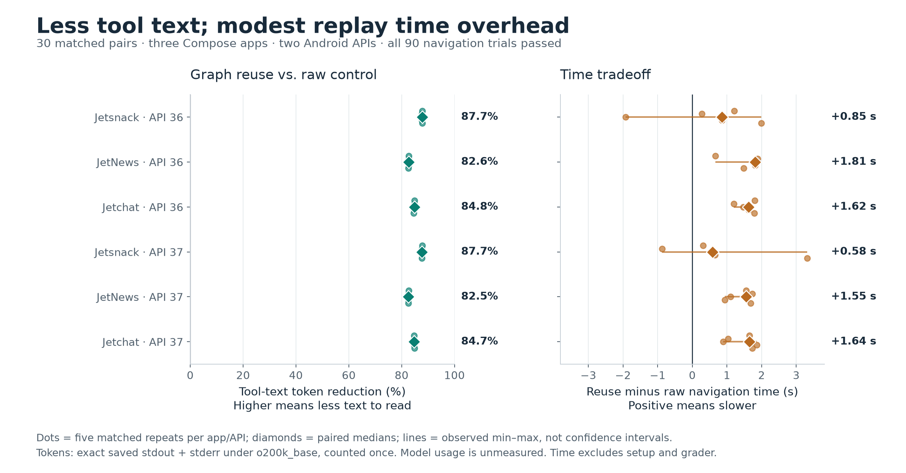
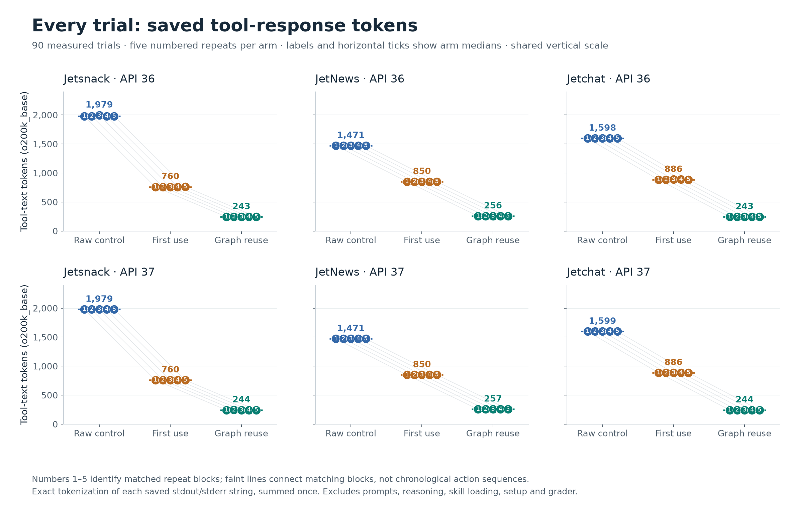
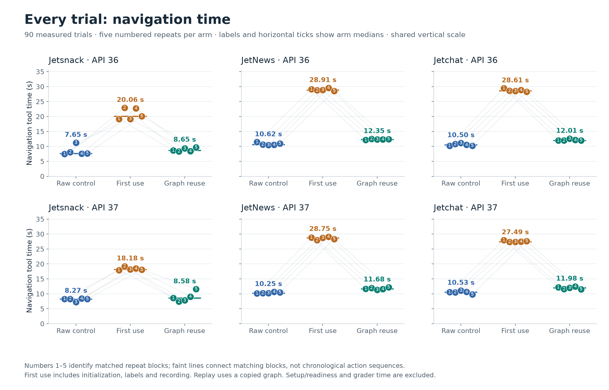
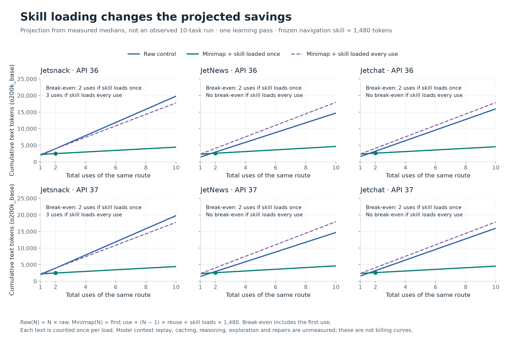
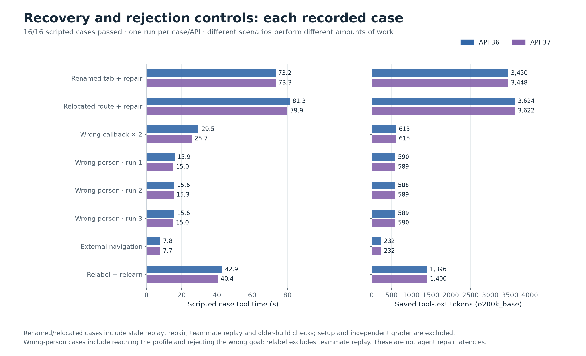
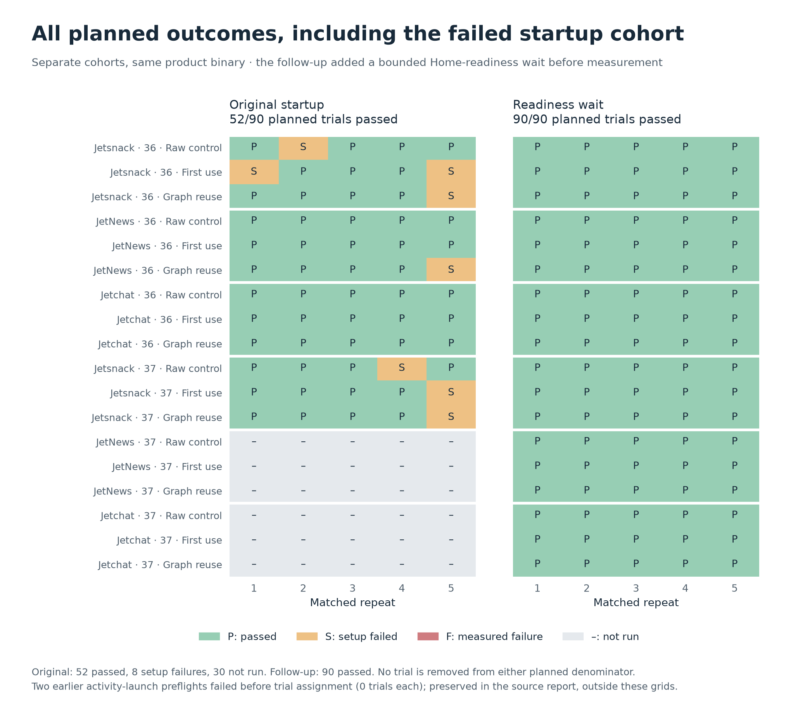

# Minimap benchmark graphs — September 17, 2026

Graph reuse returned **82.5–87.7% fewer tool-text tokens**, with **0.58–1.81 seconds more navigation time** at the paired median in each app/API case. All 90 primary trials passed their independent destination check. These are measurements of recorded tool output and subprocess time; **actual model token usage and billed savings remain unmeasured**.



## What was compared

Three pinned Jetpack Compose samples, Android APIs 36 and 37, three arms, and five matched repeat blocks: raw Android navigation with a known route; Minimap first use including initialization, labels, and recording; and Minimap replay from a copied graph with no runtime cache. The routes are Jetsnack Home → Search, JetNews Home → Interests, and Jetchat conversation → Ali Conors profile. This is a scripted device benchmark; the agent discovery and diagnosis experiment has not run.

Each saved UTF-8 stdout and stderr string was tokenized independently, preserving whitespace, then summed once per measured phase. `o200k_base` is the primary reference encoding and `cl100k_base` is a sensitivity check. No encoding is assumed to match a particular current agent model. [OpenAI's tokenizer documentation](https://developers.openai.com/cookbook/examples/how_to_count_tokens_with_tiktoken) describes counting a string under a named encoding; complete model usage also depends on messages and tools. These counts exclude prompts, tool schemas/wrappers, source reads, reasoning, context replay, caching and the independent evaluator. Tool-response text would generally become model input, not generated model output.

Navigation seconds are sums of measured top-level subprocess durations, excluding fixture setup/readiness and the independent destination grader. Those costs and their tokens remain in `trials.csv`; `total_seconds_including_setup_oracle` preserves the recorded complete trial duration. No setup failure is treated as a fast zero-second navigation. Both emulators shared one host. With five blocks per case, charts show all observations and their range, not p95 or population confidence claims.

## Every navigation trial

Every numbered dot is one trial; its number identifies a matched repeat block, not execution order. Horizontal ticks and numeric labels show arm medians. Both figures use shared vertical scales across all six cases.



| App | API | Raw tokens | First-use tokens | Reuse tokens | Paired token reduction | Raw seconds | First-use seconds | Reuse seconds | Paired extra seconds |
| --- | ---: | ---: | ---: | ---: | ---: | ---: | ---: | ---: | ---: |
| Jetsnack | 36 | 1,979 | 760 | 243 | 87.7% | 7.652 | 20.057 | 8.648 | +0.851 |
| JetNews | 36 | 1,471 | 850 | 256 | 82.6% | 10.625 | 28.907 | 12.349 | +1.810 |
| Jetchat | 36 | 1,598 | 886 | 243 | 84.8% | 10.496 | 28.608 | 12.012 | +1.618 |
| Jetsnack | 37 | 1,979 | 760 | 244 | 87.7% | 8.274 | 18.177 | 8.581 | +0.577 |
| JetNews | 37 | 1,471 | 850 | 257 | 82.5% | 10.251 | 28.754 | 11.675 | +1.551 |
| Jetchat | 37 | 1,599 | 886 | 244 | 84.7% | 10.533 | 27.487 | 11.981 | +1.645 |

Paired effects are calculated within each repeat before taking the median; they are not differences of unrelated arm medians.



First-use tool time is higher because it includes recording. First-use tool text is already smaller than raw output in this known-route fixture; that does **not** establish that an agent can discover or teach an unseen route more cheaply. Replay performs destination verification internally, returning one compact response. The raw control also checks the destination. There is no demonstrated time break-even against this scripted raw control: replay's median time is higher in all six cases.

## Learning-cost math and instruction overhead

Let `R` be raw tokens per task, `L` first-use tokens, `G` reused-graph tokens, `N` total route uses, `H` skill tokens, `S` skill loads, and `E` any additional text from exploration or maintenance:

```text
Raw(N)     = N × R
Minimap(N) = L + (N − 1) × G + S × H + E
Saved(N)   = Raw(N) − Minimap(N)
```

The full frozen navigation skill contains **1,480 `o200k_base` tokens** (1,482 under `cl100k_base`). The chart uses measured arm medians and explicitly assumes `E = 0`. It compares loading the skill once (`S = 1`) with loading it for every task (`S = N`). Only the Minimap skill is added; raw-tool instruction overhead is unmeasured and assigned zero in these scenarios. The first task is included in `L`; no extra first replay is charged. Break-even is the first integer use where Minimap is no more expensive and stays so. These are projections of text volume counted once per load, not measured long-running agent sessions or billing forecasts. Actual model calls can repeatedly consume context; caching and compaction change that cost.



| App | API | Break-even: tool text only | Break-even: skill once | Break-even: skill every use | Raw tokens at 10 | Minimap at 10, skill once | Savings at 10, skill once | Savings at 10, skill every use |
| --- | ---: | ---: | ---: | ---: | ---: | ---: | ---: | ---: |
| Jetsnack | 36 | 1 | 2 | 3 | 19,790 | 4,427 | 77.6% | +10.3% |
| JetNews | 36 | 1 | 2 | none | 14,710 | 4,634 | 68.5% | -22.1% |
| Jetchat | 36 | 1 | 2 | none | 15,980 | 4,553 | 71.5% | -11.8% |
| Jetsnack | 37 | 1 | 2 | 3 | 19,790 | 4,436 | 77.6% | +10.3% |
| JetNews | 37 | 1 | 2 | none | 14,710 | 4,643 | 68.4% | -22.1% |
| Jetchat | 37 | 1 | 2 | none | 15,990 | 4,562 | 71.5% | -11.8% |

For example, Jetchat/API 36 over ten uses gives `10 × 1,598 = 15,980` raw tokens, versus `886 + 9 × 243 + 1,480 = 4,553` with one skill load: **11,427 fewer text tokens (71.5%)**. Reloading the entire skill each task erases the projected advantage for JetNews and Jetchat. This makes concise instructions and amortizing skill/context overhead important design targets. Graph JSON is read locally by the CLI; loading it into the model is not assumed. Discovery and repair costs, their frequency, and actual context behavior still need agent-level measurements.

## Tokenizer sensitivity

The result is similar under a second encoding; that is a robustness check on text volume, not a claim about every model.

| App | API | o200k raw → reuse | o200k paired reduction | cl100k raw → reuse | cl100k paired reduction |
| --- | ---: | ---: | ---: | ---: | ---: |
| Jetsnack | 36 | 1,979 → 243 | 87.72% | 1,941 → 240 | 87.69% |
| JetNews | 36 | 1,471 → 256 | 82.60% | 1,448 → 252 | 82.60% |
| Jetchat | 36 | 1,598 → 243 | 84.79% | 1,575 → 239 | 84.83% |
| Jetsnack | 37 | 1,979 → 244 | 87.67% | 1,941 → 240 | 87.64% |
| JetNews | 37 | 1,471 → 257 | 82.53% | 1,448 → 253 | 82.53% |
| Jetchat | 37 | 1,599 → 244 | 84.74% | 1,576 → 240 | 84.77% |

## Recovery and negative controls

These source-informed scripts test the recovery contract. Renamed and relocated routes must fail stale replay, learn a repair, work from a teammate graph copy, and remain compatible with the old build. Wrong callbacks must reproduce without corrupting the graph. Wrong-person checks must reject the goal; external navigation must not produce a false success; relabel/relearn must preserve IDs. Each API has eight case records, including all three wrong-person checks.



Repair rows include multiple operations (stale replay, repair, teammate and old-build checks). Relabel costs exclude the separate teammate replay; wrong-person costs include reaching the profile before rejection. Fixture setup and independent oracles are outside these phase totals. These are case costs with different scopes, not single-repair latency comparisons. They do not measure an agent diagnosing an unexpected change.

| Case | API | Outcome | Tool seconds | Calls | Tool-text tokens |
| --- | ---: | --- | ---: | ---: | ---: |
| Renamed tab + repair | 36 | pass | 73.165 | 8 | 3,450 |
| Renamed tab + repair | 37 | pass | 73.290 | 8 | 3,448 |
| Relocated route + repair | 36 | pass | 81.268 | 8 | 3,624 |
| Relocated route + repair | 37 | pass | 79.870 | 8 | 3,622 |
| Wrong callback × 2 | 36 | pass | 29.516 | 2 | 613 |
| Wrong callback × 2 | 37 | pass | 25.671 | 2 | 615 |
| Wrong person · run 1 | 36 | pass | 15.929 | 2 | 590 |
| Wrong person · run 1 | 37 | pass | 15.035 | 2 | 589 |
| Wrong person · run 2 | 36 | pass | 15.628 | 2 | 588 |
| Wrong person · run 2 | 37 | pass | 15.339 | 2 | 589 |
| Wrong person · run 3 | 36 | pass | 15.615 | 2 | 589 |
| Wrong person · run 3 | 37 | pass | 14.988 | 2 | 590 |
| External navigation | 36 | pass | 7.792 | 1 | 232 |
| External navigation | 37 | pass | 7.743 | 1 | 232 |
| Relabel + relearn | 36 | pass | 42.900 | 6 | 1,396 |
| Relabel + relearn | 37 | pass | 40.397 | 6 | 1,400 |

The separate graph audit passed 90/90 assignments: 60 learned/copied graphs were valid and doctor stayed read-only; 30 reused graphs were unchanged. Real-Git disjoint additions: pass; conflicting-edit rejection: pass. Git checks ran once on the host and have no comparable device-time measurement.

## Outcomes and retained failures



The earlier startup cohort had 52 successes, 8 setup failures, and 30 missing assignments out of 90 planned. The follow-up retained the product binary and added a bounded Home-readiness wait to fixture setup; it reached 90/90. They are separate experiments, not retries substituted into one denominator. Two earlier activity-launch preflights failed before assigning any trials. The original reports are unchanged and remain linked in the [controlled report](../2026-09-16-controlled.md).

## Reproduce and inspect

- [Portable analysis ledger](benchmark.json): all 90 primary records, 16 controls, paired effects, projections, source hashes, and 1,146 call records.
- [Every primary trial](trials.csv), [every audited call](calls.csv), [control cases](controls.csv), and [all planned outcomes](outcomes.csv).
- Each PNG has a same-named SVG for vector export; [artifact checksums](SHA256SUMS) cover the deliverables.
- [Analysis and chart script](../../benchmark_charts.py), [audit and cost math](../../benchmark_data.py), [pinned optional dependencies](../../requirements-benchmarks.txt).

From the repository root, rebuild charts and tables from the checked-in ledger without emulators, agents, network access, or temporary raw logs (after installing the optional dependencies):

```sh
python3 -m venv /tmp/minimap-chart-env
/tmp/minimap-chart-env/bin/pip install -r evals/requirements-benchmarks.txt
/tmp/minimap-chart-env/bin/python evals/benchmark_charts.py \
  --data evals/results/2026-09-17-benchmarks/benchmark.json \
  --output /tmp/minimap-charts-rebuilt
```

To re-audit/tokenize the original saved strings, preserve the complete raw artifact directory and run:

```sh
/tmp/minimap-chart-env/bin/python evals/benchmark_charts.py \
  --report evals/results/2026-09-16-controlled.json \
  --raw-root /absolute/path/to/minimap-controlled-20260916 \
  --output /tmp/minimap-charts-retokenized
```

Extraction verifies source report SHA-256 values, every saved stream's byte count, unique assignments, and per-phase command/time/byte totals. The CSV/JSON preserve per-stream SHA-256 values and token counts. Re-rendering a ledger does not re-audit missing raw files. Raw strings remain in the external artifact directory rather than being duplicated into the repository. The output directory must be new; the tool does not overwrite historical reports.

Frozen binary: `5875a78c9a691935f1546b6c5ee32ac3ec7a289af0f50578dd68347872682f03`. Compose revision: `d3ff757b289f7036815978a8f7b16706ee3423b0`. Controlled report SHA-256: `56672397d4caa1d1df1392a5f3b1ad27730052e94654c8b3ae7904f9f4441c5d`. Tokenizer environment: `{"python": "3.12.14", "tiktoken": "0.14.0"}`. Skill fragment SHA-256: `527cd2c3e68e18de98dd2bcdaea8c94280c11ba667c155e8fbbaf51138875d1f`.

## Remaining measurement gaps

- Offline tokenization of saved tool text is not total model input/output, reasoning tokens, or billed usage.
- Known scripted routes in all arms; source exploration, action selection, and autonomous repair diagnosis are unmeasured.
- First use includes init, labeling, and recording; replay uses a copied graph without runtime state.
- Navigation timing excludes setup/readiness and the independent grader; both are retained per trial.
- Five matched blocks per app/API on one host with two emulators; no population confidence, p95, or SLA claim.
- API/device cases are separate strata; different emulator viewports and shared host load prevent attributing differences solely to Android version.
- Cost projections use measured arm medians, not a longitudinal trial; no context replay, caching, or repair frequency is modeled.
- Skill-once and skill-every-use are explicit text-volume scenarios, not observed agent policies.
- Earlier incomplete runs remain separate; their failures are not pooled into v1.2 timing measurements.
- Recovery controls are scripted and source-informed, with different work per scenario; their durations are not interchangeable repair latencies.

The prepared agent layer has **0/24 trials started**. Actual input, cached input, output and reasoning usage, autonomous discovery/repair success, and user interruption rates are still unmeasured. The next agent experiment should report those alongside task success, end-to-end time, skill/context overhead and recurring maintenance cost. No new agent or emulator trials were run to produce these charts.
