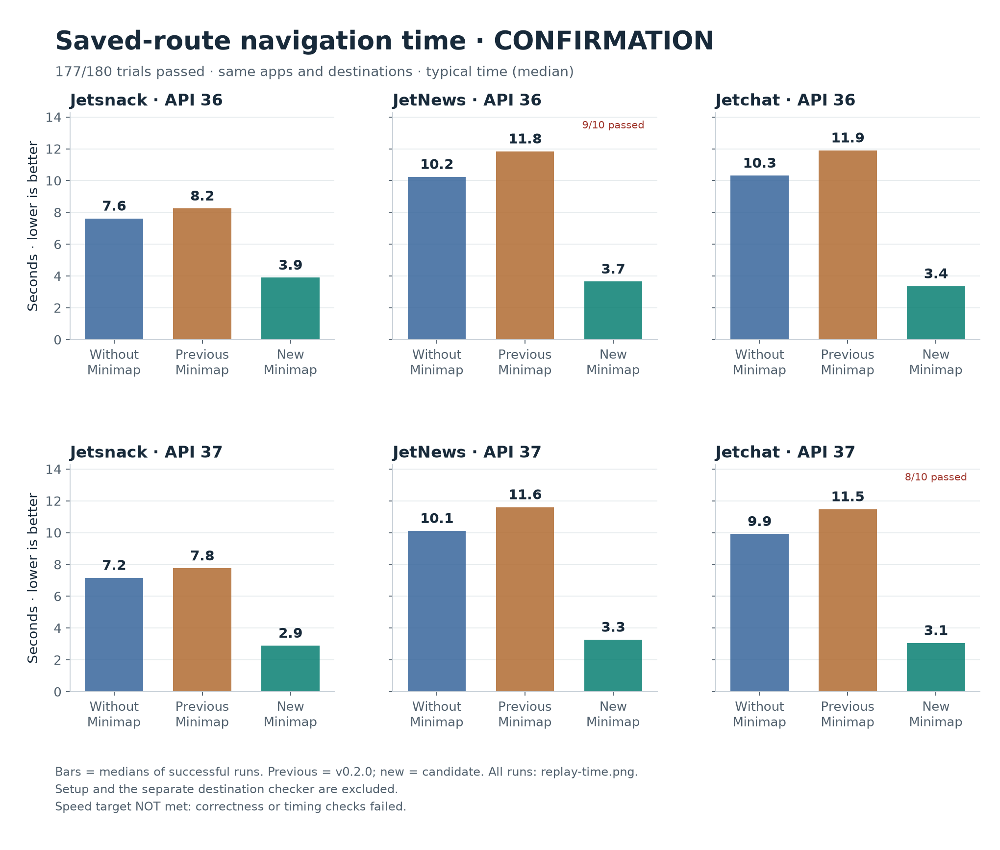
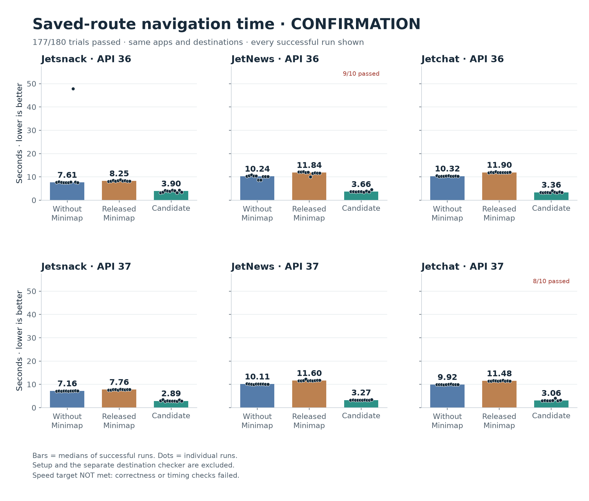

# Performance progress — September 23, 2026

**The first performance candidate did not pass the full benchmark.** Its
successful trips were faster, but one missed tap and two setup failures left
it at **57/60 successful assignments**. Both controls passed 60/60, making the
whole experiment **177/180**. These are findings from development, not a claim
that the new version is ready or that it saves money on an AI bill.

The missed tap led to a fix: wait for a button's position to agree across two
fresh observations before tapping. A separate slow-animation experiment
reproduced the earlier failure in 3/3 attempts, and the fix passed 3/3. Both
versions passed another three normal-animation attempts. The fixed version's
complete confirmation is still pending; its results will be published separately.

## Timing results before the fix



“New Minimap” in this graph means candidate05, **before** the stable-tap fix.
Each bar is the median of successful assignments for one app and Android
version. Failed assignments stay in the pass counts and [trial data](trials.csv).

| App | Android API | Without Minimap, seconds | Released Minimap, seconds | First candidate, seconds | Candidate passed |
| --- | --- | ---: | ---: | ---: | ---: |
| Jetsnack | 36 | 7.61 | 8.25 | 3.90 | 10/10 |
| JetNews | 36 | 10.24 | 11.84 | 3.66 | 9/10 |
| Jetchat | 36 | 10.32 | 11.90 | 3.36 | 10/10 |
| Jetsnack | 37 | 7.16 | 7.76 | 2.89 | 10/10 |
| JetNews | 37 | 10.11 | 11.60 | 3.27 | 10/10 |
| Jetchat | 37 | 9.92 | 11.48 | 3.06 | 8/10 |

These medians are descriptive only. The registered success rule requires all
180 assignments to pass, no false successes or graph changes, and a lower
paired median than both controls in all six app/API cases. That rule failed.
No unsuccessful assignment was retried into a success or removed.

The host also entered idle sleep during the overnight experiment. Its power
events are preserved in [host-sleep.json](host-sleep.json). The runner measures
subprocess duration using a monotonic clock, which excludes suspended host
time on this machine; these results do not describe an uninterrupted elapsed
time comparison. The next run uses a process-scoped idle-sleep assertion and
will check power events before making a speed claim.



The 47.88-second raw Jetsnack outlier remains visible. Its first Android CLI
layout consumed 43.57 seconds and returned valid output without an error;
the underlying cause was not instrumented. The median overview above does
not remove that trial from the detailed chart, ranges, or paired comparisons.

## What failed, and what changed

- **Missed tap:** candidate05's JetNews/API36 repeat 6 left the drawer open; Minimap returned `unknown`, the independent screen check failed, and the graph stayed unchanged.
- **Fixture failures:** Jetchat/API37 repeats 5 and 9, both assigned to candidate05, failed during app startup or Home readiness before navigation began; both remain failed assignments.
- **Animation reproduction:** with animations slowed to 5×, the old version tapped Interests before its reported position settled and failed all three attempts; candidate06 waited for matching positions and passed all three.
- **Fixed-version pilots:** API36 passed 9/9 assignments; API37 passed 6/9, with all three Jetchat assignments unstarted after baseline seed verification exhausted its time budget during host sleep.
- **Host fix:** a temporary `caffeinate -i` assertion now prevents idle sleep only while the benchmark process runs; the original trials and original time/input limits remain intact.

The trace shows the old version tapping Interests at `[267,537]` while later
observations report `[266,537]`; the fixed version waits for the repeated
`[266,537]` observation before tapping. This reproduces an animation-sensitive
failure, but does not prove the exact Android input-dispatch cause of the
earlier uninstrumented miss. All 12 diagnostic assignments are preserved in
[drawer-diagnostic.json](drawer-diagnostic.json). The emulator's animation
setting was restored and verified afterward. Wrapped diagnostic times include
tracing overhead and are not used to establish a speedup.

There were **zero false successes and zero unexpected graph changes** in the
180-assignment cohort. Earlier candidate05 recovery checks verified all 16
distinct functional cases across 17 attempts: one retained relabel-startup
failure and a separately recorded passing follow-up. See
[control accounting](controls-assessment.json). Candidate06's complete recovery
suite is part of the follow-up validation, not a completed result in this report.

## Text tokens and money

For successful matched trips, candidate05 returned **82.5–87.7% less tool text**
than the raw script under `o200k_base`. [tool-text.json](tool-text.json) audits
the exact saved stdout and stderr, counts each stream once under two reference
encodings, and retains every failed assignment. No AI was making decisions in
these device trials.

The full navigation skill alone is 1,480 `o200k_base` tokens. Instructions,
conversation context, repeated context reads, caching, model output, and
reasoning can change the total substantially. **Actual model token usage and
dollar savings remain unmeasured.** No benchmark agents were launched. The
prepared 18-trial agent comparison awaits explicit authorization; future
prices will be API-equivalent estimates, not ChatGPT subscription charges.

## Method and provenance

The experiment uses Jetsnack Home → Search, JetNews Home → Interests, and
Jetchat Home → Ali Conors's profile, on emulators with Android APIs 36 and 37.
The Compose samples are pinned to `d3ff757b289f7036815978a8f7b16706ee3423b0`.
Each app/API has ten rotating matched blocks of raw script, released Minimap,
and candidate, with one device worker at a time. The raw script already knows
the route; both Minimap arms use fresh copies of the same graph learned by the
released binary. Setup and seed learning are outside the measured navigation;
a separate fresh Android CLI layout grades each completed attempt afterward.
Raw Python selector parsing is also outside the subprocess timing.

Most of the proposed speed improvement comes from faster fresh accessibility
observations. A small bundled helper connects, captures the UI, and exits;
its upload and all replay checks are included in navigation timing. Learning
and fallback observations still use Android CLI. This compares against the
existing Android CLI observer, not every possible raw automation backend.
Short one- and two-tap routes on two emulators cannot establish reliability
for physical phones, long routes, large graphs, or arbitrary app states.

| Build | Source | Binary SHA-256 |
| --- | --- | --- |
| Released control | `5c9298e` | `d43ba8fa8f0a99a57ca2695a64c76dec3152a02bb9030f537e3ad18dd035cd47` |
| First candidate | `420e791` | `a3d37837010638b9151082d99897a569c63dad2840e53fd9f9fd695b79991fac` |
| Stable-tap fix | `ce3ed53` | `9b96ab7c011f46540c86659e8159e939452e84bf14bde02b627a96a415d176e9` |

The proposed code is in [PR #12](https://github.com/mttmcknn/minimap/pull/12).
Its 159 Rust tests, 42 evaluator tests, Clippy, Linux/macOS CI, crate packaging,
and helper rebuild passed. A deterministic moving-control regression fails on
the frozen old candidate and passes with the fix. That evidence supports the
fix but does not replace emulator confirmation.

## Evidence and reproduction

[All assignments (CSV)](trials.csv) · [Timing summary (JSON)](summary.json) ·
[Protocol and binary manifest](manifest.json) · [Tool-text audit](tool-text.json) ·
[Raw evidence ZIP](evidence.zip) · [Archive member hashes](evidence-files.json)

The archive preserves original stdout/stderr, graphs, reports, pilots,
diagnostics, controls, and frozen harnesses. Private runtime caches and APK
binaries are excluded. It also contains `analysis-tools/` from `1b24d4e` for
reproducing the charts and text audit. For example, after unpacking the archive:

```sh
python3 -m venv /tmp/minimap-chart-env
/tmp/minimap-chart-env/bin/pip install -r analysis-tools/requirements-benchmarks.txt
/tmp/minimap-chart-env/bin/python analysis-tools/replay_charts.py \
  /absolute/path/to/this/report/summary.json --output /tmp/minimap-progress-graphs
```

Add `--medians-only` with a different output directory for the overview. Every
published file is covered by `SHA256SUMS`. This report is an immutable progress
snapshot; later fixed-version results must be a separate cohort.
