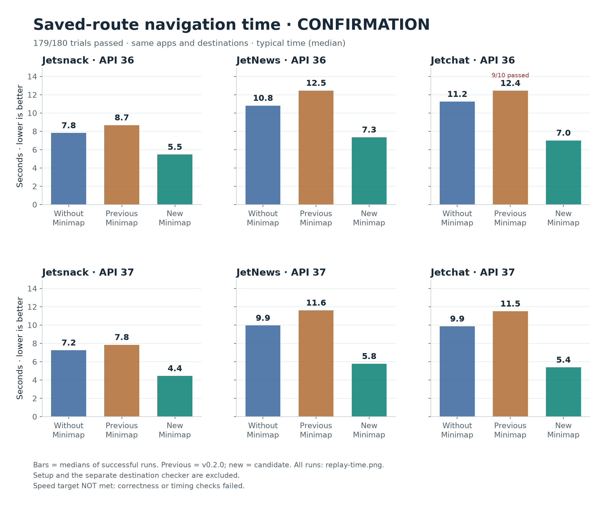
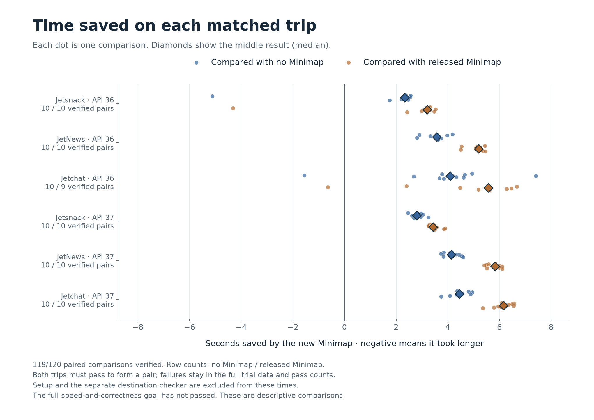
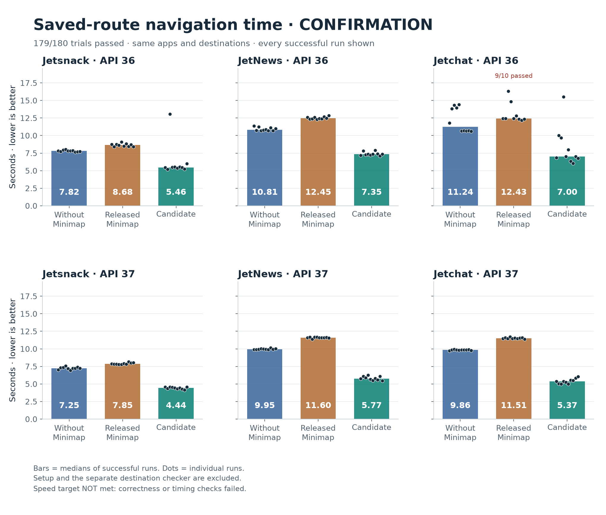
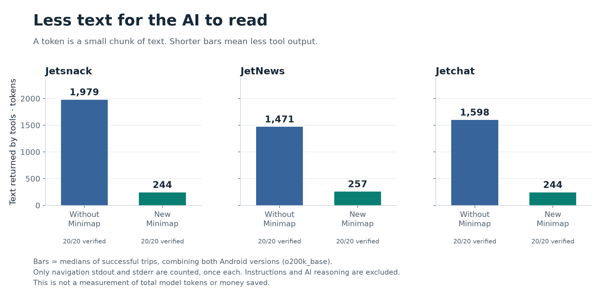

# Saved-route performance — September 23, 2026

**The fixed test build reached the correct destination in 60/60 trips.** Its median paired navigation times were 30–45% lower than the script without Minimap across the six app/Android cases. The whole comparison verified **179/180 assignments**. These are observed timing improvements, not a passed overall acceptance gate or a measured saving on an AI bill.

These are measurements of the **test build in [PR #12](https://github.com/mttmcknn/minimap/pull/12)**,
not a new published release. Every assignment, including unsuccessful or
unverified assignments, remains in the data.

## Navigation time



Each bar shows the median: the middle time when the successful trips are put
in order. Shorter bars mean less waiting. These routes take one or two taps;
the scripts already know where to go, so no AI makes decisions during them.

| App | Android API | Without Minimap | Released Minimap | New test build | New build verified |
| --- | --- | ---: | ---: | ---: | ---: |
| Jetsnack | 36 | 7.82 s | 8.68 s | 5.46 s | 10/10 |
| JetNews | 36 | 10.81 s | 12.45 s | 7.35 s | 10/10 |
| Jetchat | 36 | 11.24 s | 12.43 s | 7.00 s | 10/10 |
| Jetsnack | 37 | 7.25 s | 7.85 s | 4.44 s | 10/10 |
| JetNews | 37 | 9.95 s | 11.60 s | 5.77 s | 10/10 |
| Jetchat | 37 | 9.86 s | 11.51 s | 5.37 s | 10/10 |

The next graph compares matching repeats. A dot to the right of zero means
the new build finished sooner; a dot to the left means it took longer.
Diamonds show the middle difference. Only pairs with two verified successful
trips appear here; the full pass counts still include every assignment.



| App | API | Median time saved vs. no Minimap | Faster verified pairs | Median time saved vs. release | Faster verified pairs |
| --- | --- | ---: | ---: | ---: | ---: |
| Jetsnack | 36 | 2.33 s (29.8%) | 9/10 | 3.20 s (36.9%) | 9/10 |
| JetNews | 36 | 3.57 s (33.0%) | 10/10 | 5.19 s (41.5%) | 10/10 |
| Jetchat | 36 | 4.09 s (35.4%) | 9/10 | 5.57 s (42.6%) | 8/9 |
| Jetsnack | 37 | 2.80 s (38.5%) | 10/10 | 3.42 s (43.3%) | 10/10 |
| JetNews | 37 | 4.13 s (41.7%) | 10/10 | 5.82 s (50.2%) | 10/10 |
| Jetchat | 37 | 4.45 s (45.2%) | 10/10 | 6.15 s (53.6%) | 10/10 |



The 13.06-second Jetsnack/API36 candidate trip and the 15.50-second
Jetchat/API36 candidate trip remain in every applicable range and comparison.
Both reached the correct destination, but both were slower than their paired
controls. The uninstrumented confirmation does not establish why those trips
were slower. A faster median is not a guarantee that every trip will be faster.

## Correctness and the acceptance rule

| Method | Verified successful assignments |
| --- | ---: |
| Without Minimap | 60/60 |
| Released Minimap | 59/60 |
| Fixed test build | 60/60 |

**The strict overall acceptance gate did not pass.** There were 0 confirmed false successes, 1 reported success that the independent checker could not verify, and 0 unexpected graph changes.

The rule was fixed before confirmation: all 180 assignments must pass,
destinations must be independently verified, graphs must stay unchanged, and
the candidate must have a lower paired median than both controls in every
app/API case. The host must also remain awake throughout the experiment.
Failed assignments are never retried into a success or removed.

- **Jetchat, API 36, repeat 5, baseline:** Command failed: ['android', 'layout', '--device=emulator-5556']; see output 558.

For the Jetchat/API36 released-control checker timeout, the retained JSON
contains both unique expected profile anchors. The checker nevertheless
failed to exit within 60 seconds, so its original grade remains unverified.
That output is diagnostic evidence, not a reason to change the rule after the
experiment. See [the original timeout and output hash](oracle-timeout-note.json).

The [host-continuity audit](host-awake-assessment.json) passed: no sleep/wake events occurred during the confirmation interval, and elapsed wall time agreed with the active-host clock within two seconds for each emulator worker. Idle sleep was prevented only while the benchmark process ran.

The fixed build also passed **16/16 separate recovery and rejection checks**,
eight on each Android version: renamed or moved routes, a broken callback,
three wrong-profile checks, external navigation, and relabel/relearn with
teammate reuse. These repairs were scripted; they do not demonstrate an AI
discovering and repairing an unknown route on its own. The fresh preparation
pilots passed 18/18 and are not pooled into the confirmation results.

## Tool text and AI cost

For successful paired trips, the new build returned **82.5–87.7% less navigation-tool text** under `o200k_base`. For roughly every 100 text tokens from the raw tools, Minimap returned 12–17. No model was making decisions in these device trials.



| App | API | Without Minimap, tokens | New build, tokens | Median paired reduction |
| --- | --- | ---: | ---: | ---: |
| Jetsnack | 36 | 1,979.0 | 244.0 | 87.7% |
| JetNews | 36 | 1,471.0 | 256.0 | 82.6% |
| Jetchat | 36 | 1,598.0 | 243.5 | 84.8% |
| Jetsnack | 37 | 1,979.0 | 243.5 | 87.7% |
| JetNews | 37 | 1,471.0 | 257.0 | 82.5% |
| Jetchat | 37 | 1,599.0 | 244.0 | 84.7% |

The [text audit](tool-text.json) checks the saved stdout/stderr against their
hashes and counts each stream once under both `o200k_base` and `cl100k_base`.
It retains all assignments. The graph combines both Android versions for
readability; the table keeps them separate. Setup and the independent checker
are excluded from navigation totals.

The full navigation instructions alone contain **1,480 `o200k_base` tokens**.
Loading those instructions for each short task can erase the tool-text saving
before accounting for other context and reasoning. An agent can also reread
earlier tool output on later decisions, and prompt caching changes its price.
**Actual model usage and dollar savings are still unmeasured.**

The [prepared 18-trial agent plan](agent-plan.json) uses three apps, navigation
with and without Minimap, and three repeats. Each trial has a 180-second and
32-input limit, matching source, and an independent checker. The model and
price assumptions are pinned. [No agent trials have started](agent-status.json):
the batch awaits explicit authorization. Any later dollar figures will be
conditional API-equivalent estimates, not measured ChatGPT subscription charges.

## What changed

The candidate reads fresh accessibility information with a small bundled
helper that connects, captures the screen, and exits. Uploading that helper
and verifying the route are included in the measured time. Learning still
uses Android CLI. If the faster observer cannot reliably recognize a screen,
Minimap falls back to a fresh Android CLI observation before changing its graph.

An earlier candidate sometimes tapped before a drawer finished moving. The
fixed build requires a unique enabled button to hold the same position across
two fresh observations before tapping. In a separate three-repeat test with
animations slowed to 5×, the old build passed 0/3 attempts and the fix passed
3/3; both also passed three normal-animation trips. The diagnostic demonstrates
an animation-sensitive failure, but does not establish the exact input-dispatch
cause of the earlier uninstrumented miss.

The implementation passed 159 Rust tests, 42 evaluator tests, Clippy, crate
packaging, helper rebuild, and Linux/macOS CI. A deterministic moving-button
regression fails on the frozen old candidate and passes with the fix.

## Method and limits

The routes are Jetsnack Home → Search, JetNews Home → Interests, and Jetchat
Home → Ali Conors's profile. The Compose samples are pinned to
`d3ff757b289f7036815978a8f7b16706ee3423b0`. The same APKs, goals, and copied seed
graphs are used by each method. Ten rotating blocks per app/API yield
3 methods × 3 apps × 2 Android versions × 10 repeats = **180 assignments**.
One emulator worker runs at a time on the same Mac.

Timing sums top-level subprocess durations. It includes replay observations,
inputs, and goal verification, but excludes app startup, seed learning, and
the independent grader. Raw Python selector parsing is outside that clock.
This measures steady-state device navigation, not a user's full AI task or
the upfront cost of recording a route.

Much of the speed change comes from faster screen observations. The raw
control uses the existing Android CLI observer; this experiment does not
isolate graph reuse from observation-backend improvements or compare every
possible raw automation backend. Short routes on two emulators cannot prove
reliability on physical devices, long routes, large graphs, or arbitrary app states.

| Build | Source | Binary SHA-256 |
| --- | --- | --- |
| Released control | `5c9298e` | `d43ba8fa8f0a99a57ca2695a64c76dec3152a02bb9030f537e3ad18dd035cd47` |
| Fixed candidate | `ce3ed53` | `9b96ab7c011f46540c86659e8159e939452e84bf14bde02b627a96a415d176e9` |

The [earlier candidate's report](../2026-09-23-performance-progress/README.md)
remains unchanged: 57/60 candidate assignments passed, versus 60/60 for each
control, with a missed tap, two setup failures, and host sleep. Initial
overnight candidate06 pilots also remain preserved, including three unstarted
Jetchat assignments after seed verification timed out during host sleep.
Those runs are separate from the fresh awake pilots and this confirmation.

## Evidence and reproduction

[All trials](trials.csv) · [Paired differences](paired.csv) ·
[Summary and acceptance gates](summary.json) · [Frozen plan](manifest.json) ·
[Recovery checks](controls-assessment.json) · [Host audit](host-awake-assessment.json) ·
[Raw evidence ZIP](evidence.zip) · [Archive member hashes](evidence-files.json)

The archive preserves original stdout/stderr, graphs, pilots, diagnostics,
controls, and frozen harnesses. APKs, binaries, and private runtime caches are
excluded. `analysis-tools/` contains the chart and token-audit scripts. After
unpacking `evidence.zip`, use a fresh environment and new output directories:

```sh
python3 -m venv /tmp/minimap-chart-env
/tmp/minimap-chart-env/bin/pip install -r analysis-tools/requirements-benchmarks.txt
/tmp/minimap-chart-env/bin/python analysis-tools/replay_charts.py \
  /absolute/path/to/this/report/summary.json --output /tmp/minimap-full-chart
```

Use `--medians-only` or `--paired` with separate output directories for the
other timing views. To reproduce the token audit and its graph:

```sh
/tmp/minimap-chart-env/bin/python analysis-tools/replay_text.py \
  /absolute/path/to/this/report/summary.json --raw-root /absolute/path/to/unpacked/evidence \
  --skill /absolute/path/to/this/report/navigation-skill.md --output /tmp/minimap-text.json
/tmp/minimap-chart-env/bin/python analysis-tools/replay_charts.py \
  /tmp/minimap-text.json --text-tokens --output /tmp/minimap-text-chart
```

Every published file is covered by `SHA256SUMS`. This report records one
finished cohort; future fixes or experiments must retain a separate denominator.
